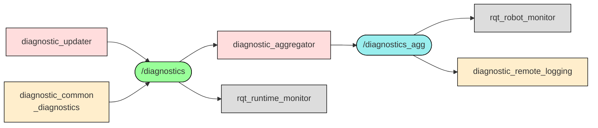

    
 

__Build farm jobs:__

|  | Rolling | Lyrical | Kilted | Jazzy | Humble |
| --- | - | - | - | - | - |
| `dev` |  |  |  |  |  |
| `bin` |  |  |  |  |  |

# Overview

The diagnostics system collects information about hardware drivers and robot hardware to make them available to users and operators.
The diagnostics system contains tools to collect and analyze this data.

The diagnostics system is built around the `/diagnostics` topic. The topic is used for `diagnostic_msgs/DiagnosticArray` messages.
It contains information about the device names, status, and values.

It contains the following packages:

- [`diagnostic_aggregator`](/diagnostic_aggregator/): Aggregates diagnostic messages from different sources into a single message.
- `diagnostic_analysis`: *Not ported to ROS2 yet* __#contributions-welcome__
- [`diagnostic_common_diagnostics`](/diagnostic_common_diagnostics/): Predefined nodes for monitoring your system.
- [`diagnostic_updater`](/diagnostic_updater/): Base classes to publishing custom diagnostic messages for Python and C++.
- [`diagnostic_remote_logging`](/diagnostic_remote_logging/): Utilities for forwarding diagnostics to remote systems, e.g. influxdb.
- [`diagnostic_topic_monitor`](/diagnostic_topic_monitor/): __coming soon ([#633](https://github.com/ros/diagnostics/pull/633))__ Components for monitoring topic health and publishing diagnostics.
- [`self_test`](/self_test/): Tools to perform self tests on nodes.

## Quick start

To use these packages, install them using `apt install ros-$ROS_DISTRO-diagnostics`.

## Typical data flow

At the points of interest, i.e. the hardware drivers, the diagnostic data is collected.
The data must be published on the `/diagnostics` topic.
In the `diagnostic_updater` package, there are base classes to simplify the creation of diagnostic messages.

The `diagnostic_aggregator` package provides tools to aggregate diagnostic messages from different sources into a single message. It has a plugin system to define the aggregation rules.

## Visualization

Outside of this repository, there is [`rqt_robot_monitor`](https://index.ros.org/p/rqt_robot_monitor/) to visualize diagnostic messages that have been aggregated by the `diagnostic_aggregator`.

Diagnostics messages that are not aggregated can be visualized by [`rqt_runtime_monitor`](https://index.ros.org/p/rqt_runtime_monitor/).

# Contributions

Contributions are always welcome.
Including but not limited to issues with the [__PR welcome 💞__ label](https://github.com/ros/diagnostics/issues?q=is%3Aissue%20state%3Aopen%20label%3A%22PR%20welcome%20%F0%9F%92%9E%22).

New features are to be developed in custom branches and PRs should target the `ros2` branch.

From there, the changes are backported to the other branches.

## Target Distribution

- __Rolling Ridley__ by the [`ros2` branch](https://github.com/ros/diagnostics/tree/ros2)
- __Lyrical Luth__ by the [`ros2-lyrical` branch](https://github.com/ros/diagnostics/tree/ros2-lyrical)
- __Humble Hawksbill__ by the [`ros2-humble` branch](https://github.com/ros/diagnostics/tree/ros2-humble)
- __Jazzy Jalisco__ by the [`ros2-jazzy` branch](https://github.com/ros/diagnostics/tree/ros2-jazzy)
- __Kilted Kaiju__ by the [`ros2-kilted` branch](https://github.com/ros/diagnostics/tree/ros2-kilted)

## Versioning and Releases

- (__X__.0.0) We use the major version number to indicate a breaking change.
- (0.__Y__.0) The minor version number is used to differentiate between different ROS distributions:
  - x.__0__.z: Humble Hawksbill
  - x.__2__.z: Jazzy Jalisco
  - x.__3__.z: Kilted Kaiju
  - x.__4__.z: Lyrical Luth
  - x.__5__.z: Rolling Ridley
  - (Future releases will receive x.__5__.z and rolling will then be x.__6__.z)
- (0.0.__Z__) The patch version number is used for changes in the current ROS distribution that do not affect the API.

# License

The source code is released under a [BSD 3-Clause license](LICENSE).
